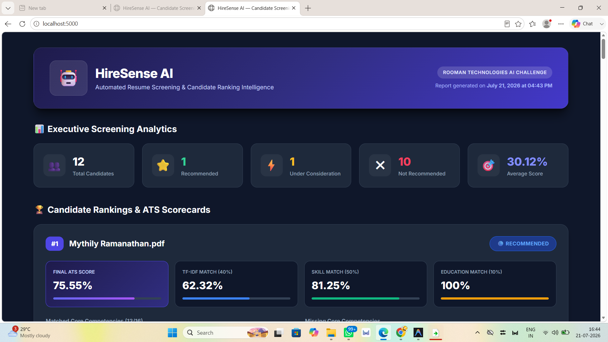
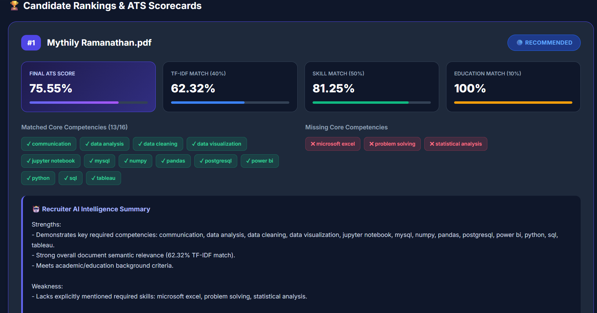
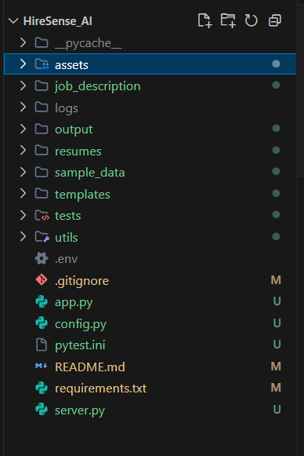
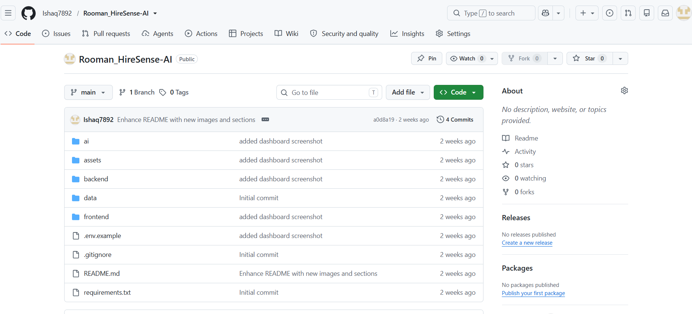
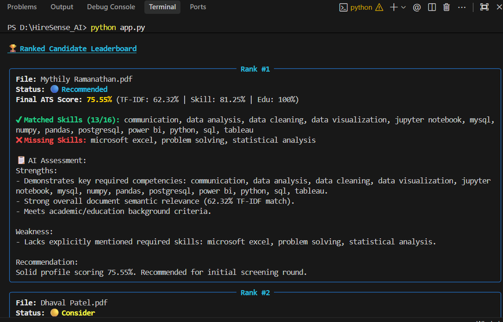
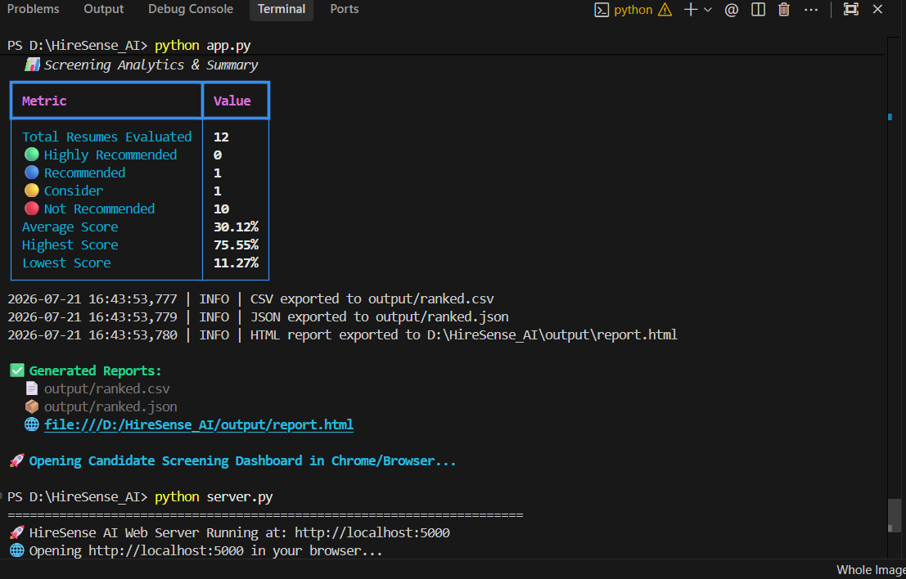
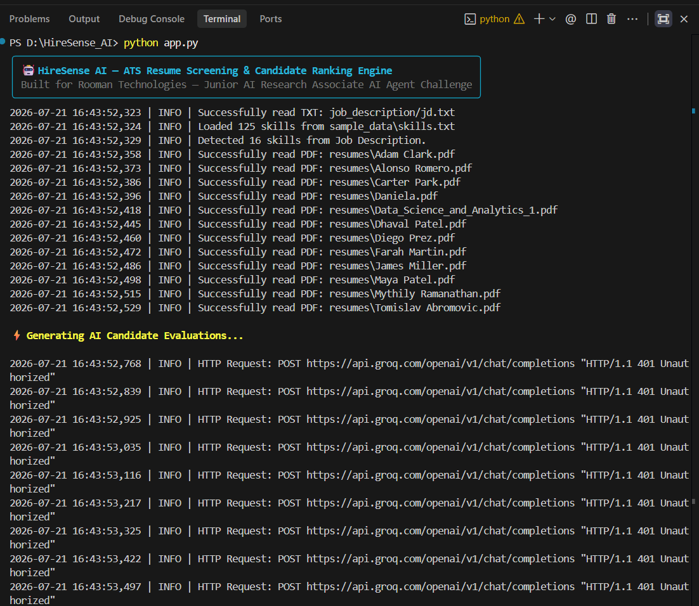

<h1 align="center">
  <br>
  🤖 HireSense AI — ATS Resume Screening & Candidate Ranking Engine
  <br>
</h1>

<h4 align="center">AI-Powered Resume Screening & Candidate Ranking System</h4>

<p align="center">
  <a href="#key-features">Key Features</a> •
  <a href="#architecture">Architecture</a> •
  <a href="#installation">Installation</a> •
  <a href="#how-to-run-the-application">How to Run</a> •
  <a href="#scoring-formula">Scoring Formula</a> •
  <a href="#screenshots">Screenshots</a>
</p>

---

## ✨ Key Features

- **Smart Multi-Format Resume Parsing**: Parse PDF, DOCX, and TXT candidate resumes automatically
- **Structured Skill Extraction**: Extract technical skills, work history, and education qualifications
- **Deterministic ATS Scoring Engine**: Calculate weighted ATS scores (50% Skill Match, 40% TF-IDF Cosine Similarity, 10% Education Match)
- **Candidate Leaderboard & Ranking**: Rank candidates with interactive CLI leaderboard and status badges
- **AI Assessment Summaries**: Generate comprehensive candidate evaluations (Strengths, Weaknesses, Recommendations) using Groq LLM with a robust fallback
- **Skill Gap Analysis**: Identify matched vs missing core competencies for each candidate
- **Professional Web Dashboard**: Modern, dark-mode responsive recruiter UI with glassmorphism aesthetics
- **Multi-Format Export Options**: Export candidate evaluations to CSV, JSON, and interactive HTML dashboards

---

## 🏗️ Architecture

### System Architecture Diagram

```
                             Job Description (jd.txt)
                                        │
                                        ▼
                         ┌─────────────────────────────┐
                         │   Job Description Parser    │
                         │    (utils/jd_parser.py)     │
                         └──────────────┬──────────────┘
                                        │
                             Extracted Requirements
                                        │
                                        ▼
┌──────────────────┐       ┌───────────────────────────┐
│ Candidate Files  ├──────►│   Multi-Format Parser     │
│ (PDF, DOCX, TXT) │       │   (utils/pdf_parser.py)   │
└──────────────────┘       └────────────┬──────────────┘
                                        │
                             Extracted Resume Text
                                        │
                                        ▼
                           ┌───────────────────────────┐
                           │    Text Normalizer        │
                           │   (utils/text_cleaner.py) │
                           └────────────┬──────────────┘
                                        │
                                        ▼
                           ┌───────────────────────────┐
                           │      Resume Parser        │
                           │  (utils/resume_parser.py) │
                           └────────────┬──────────────┘
                                        │
                                        ▼
                           ┌───────────────────────────┐
                           │    ATS Scoring Engine     │
                           │    (utils/scorer.py)      │
                           │  • 50% Skill Match        │
                           │  • 40% TF-IDF Similarity  │
                           │  • 10% Education Match    │
                           └────────────┬──────────────┘
                                        │
                                        ▼
                           ┌───────────────────────────┐
                           │  AI Candidate Evaluator   │
                           │      (utils/llm.py)       │
                           │ (Groq Llama-3.3 / Fallback)│
                           └────────────┬──────────────┘
                                        │
             ┌──────────────────────────┼──────────────────────────┐
             ▼                          ▼                          ▼
    ┌─────────────────┐        ┌─────────────────┐        ┌─────────────────┐
    │  output/        │        │  output/        │        │  output/        │
    │  ranked.csv     │        │  ranked.json    │        │  report.html    │
    └─────────────────┘        └─────────────────┘        └────────┬────────┘
                                                                   │
                                                                   ▼
                                                          ┌─────────────────┐
                                                          │  Localhost Web  │
                                                          │  Server (5000)  │
                                                          │  (server.py)    │
                                                          └─────────────────┘
```

### Component Architecture & Folder Structure

```
HireSense_AI/
│
├── app.py                  # Main CLI execution engine & report coordinator
├── server.py               # Localhost web server script (http://localhost:5000)
├── config.py               # Environment configuration loader
├── requirements.txt        # Core project dependencies
├── .env                    # Groq API Key configuration
├── README.md               # Project documentation
│
├── job_description/
│   └── jd.txt              # Target job description input file
│
├── resumes/
│   └── *.pdf, *.docx, *.txt# Candidate resumes folder
│
├── sample_data/
│   └── skills.txt          # Technical skill database taxonomy
│
├── templates/
│   └── report_template.html# Recruiter dashboard HTML layout template
│
├── assets/
│   └── style.css           # Recruiter dashboard CSS stylesheet
│
├── utils/                  # Core Processing & Engine Modules
│   ├── jd_parser.py        # Extracts job requirements, skills, and education criteria
│   ├── resume_parser.py    # Extracts candidate skills, work history, and education
│   ├── pdf_parser.py       # Reads PDF (PyMuPDF), DOCX (python-docx), and TXT files
│   ├── text_cleaner.py     # Cleans and normalizes raw text using RegEx
│   ├── skills_loader.py    # Caches and loads technical skills taxonomy
│   ├── scorer.py           # Calculates TF-IDF similarity, skill match %, & ATS scores
│   ├── llm.py              # Generates AI candidate summaries (Groq Llama-3.3 + Fallback)
│   ├── exporter.py         # Exports evaluation results to CSV, JSON, and HTML
│   └── logger.py           # System logging module
│
├── tests/                  # Automated Unit Test Suite
│   ├── test_jd_parser.py   # Unit tests for JD parser module
│   ├── test_resume_parser.py # Unit tests for resume parser module
│   ├── test_scorer.py      # Unit tests for ATS scoring engine
│   └── test_skills_loader.py # Unit tests for skill database loader
│
└── output/                 # Generated Output Artifacts
    ├── ranked.csv          # Exported candidate leaderboard CSV dataset
    ├── ranked.json         # Exported candidate leaderboard JSON payload
    └── report.html         # Generated interactive recruiter web dashboard
```

---

## ⚙️ Installation

### Requirements
- Python 3.10 or higher
- pip
- A Groq API key (optional — built-in structured evaluation engine fallback included)

### Step-by-Step Setup

1. **Clone the repository**
   ```bash
   git clone https://github.com/Ishaq7892/Rooman_HireSense-AI.git
   cd HireSense_AI
   ```

2. **Create a virtual environment**
   ```bash
   python -m venv .venv
   ```

3. **Activate the virtual environment**
   - Windows (PowerShell):
     ```bash
     .venv\Scripts\activate
     ```
   - Linux / macOS:
     ```bash
     source .venv/bin/activate
     ```

4. **Install dependencies**
   ```bash
   pip install -r requirements.txt
   ```

---

## 🔧 Environment Variables

Create or configure a `.env` file in the root directory:

```env
# Groq API Configuration
GROQ_API_KEY=your_groq_api_key_here
```

> 💡 **Note**: If `GROQ_API_KEY` is omitted, HireSense AI automatically utilizes a built-in structured evaluation engine fallback so all evaluations run seamlessly.

---

## 🚀 How to Run the Application

### 1. Run Candidate Resume Screening & Open Dashboard
```bash
python app.py
```
- Parses `job_description/jd.txt` and candidate resumes in `resumes/`.
- Computes weighted ATS scores, skill gaps, and AI recruiter evaluations.
- Displays an interactive leaderboard in terminal.
- Exports `output/ranked.csv`, `output/ranked.json`, and `output/report.html`.
- **Automatically opens `output/report.html` in your default browser**.

### 2. Host Localhost Web Dashboard (`http://localhost:5000`)
```bash
python server.py
```
- Hosts the web dashboard live at **`http://localhost:5000`**.
- Handles dynamic port selection automatically if port 5000 is occupied.

### 3. Run Automated Unit Tests
```bash
python -m unittest discover -s tests
```

---

## 📊 Scoring Formula

The candidate **Final ATS Score** is calculated deterministically:

$$\text{Final Score} = (\text{Skill Match Score} \times 0.50) + (\text{TF-IDF Similarity} \times 0.40) + (\text{Education Match} \times 0.10)$$

| Component | Weight | Description |
|-----------|--------|-------------|
| **Skill Match** | **50%** | Match ratio of candidate skills against JD required skills |
| **TF-IDF Similarity** | **40%** | Cosine similarity between resume text and job description term vectors |
| **Education Match** | **10%** | 100% if required degree qualification is matched, else 0% |

### Candidate Recommendation Badges
- **🟢 Highly Recommended**: ATS Score $\ge 85\%$
- **🔵 Recommended**: ATS Score $\ge 70\%$
- **🟡 Consider**: ATS Score $\ge 50\%$
- **🔴 Not Recommended**: ATS Score $< 50\%$

---

## 📈 Screenshots

### HTML Report


### Candidate Ranking


### Project Folder


### GitHub Repository


### Terminal Output



### Unit Tests


---

## 🚀 Future Improvements

- [ ] Persistent database (PostgreSQL/MongoDB) instead of in-memory
- [ ] User authentication & multi-user support
- [ ] Cloud deployment (AWS/GCP/Azure)
- [ ] Batch processing for large volumes of resumes
- [ ] Customizable scoring weights via UI
- [ ] Email notifications for recruiter teams
- [ ] ATS platform integrations (Greenhouse, Lever, etc.)
- [ ] Multi-language support

---

## 📜 License

This project is open source and available under the MIT License.

---

## 🤝 Contributing

Contributions, issues, and feature requests are welcome! Feel free to check issues or submit pull requests.

---

## 🙏 Acknowledgments

- **Rooman Technologies**: For hosting the Junior AI Research Associate Challenge
- **Groq**: For providing LLM API acceleration
- **Scikit-Learn**: For TF-IDF vectorization and cosine similarity matching
- **Rich**: For terminal output formatting

---

<p align="center">
  Made with ❤️ for Junior AI Research Associate AI Agent Challenge
</p>

