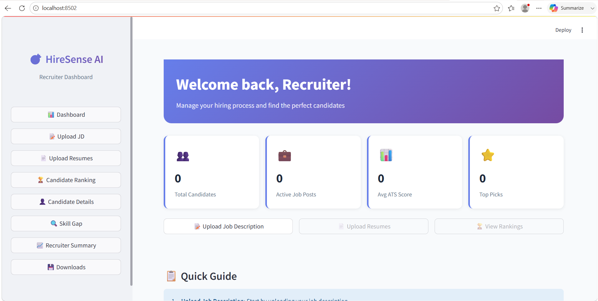
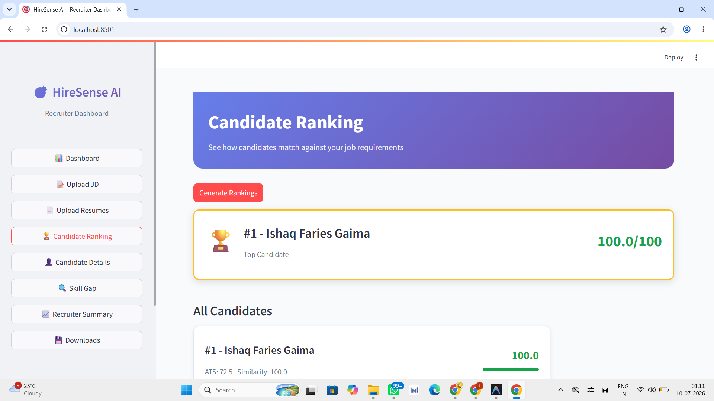
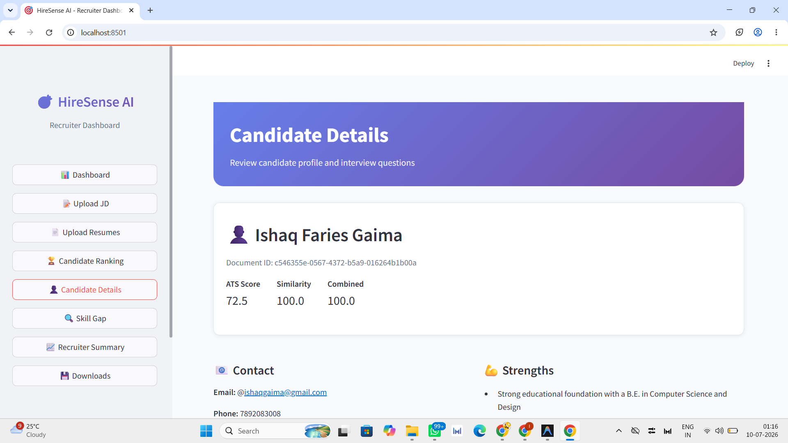
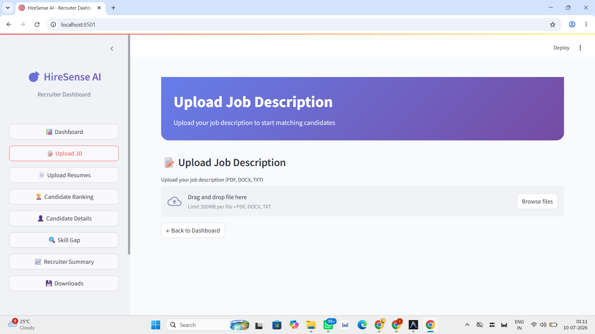
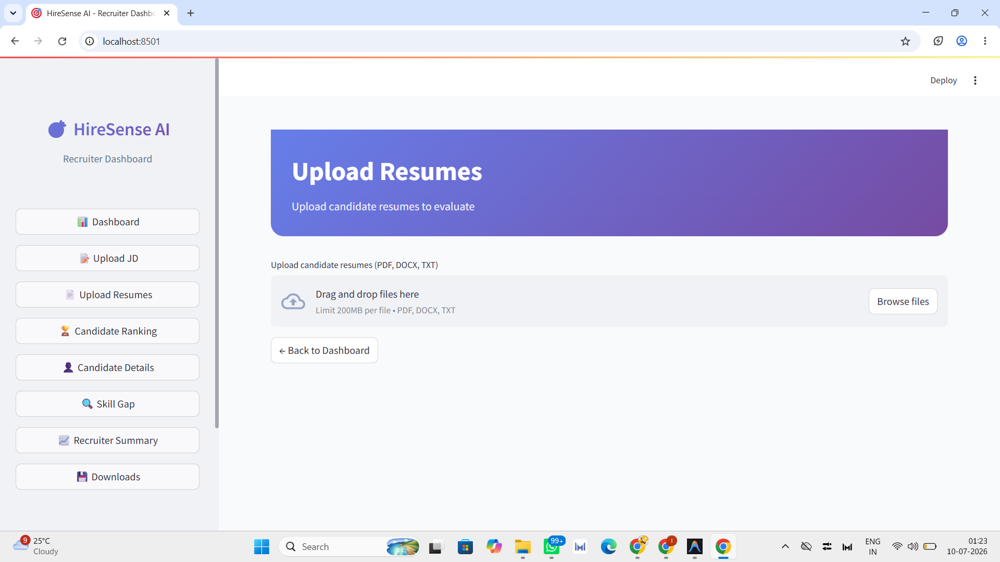
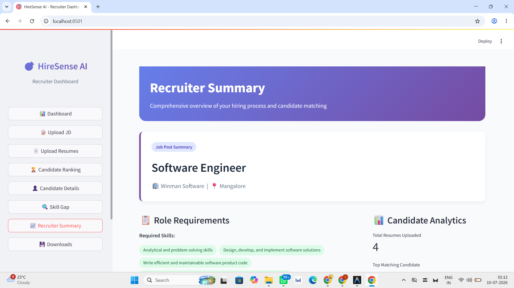
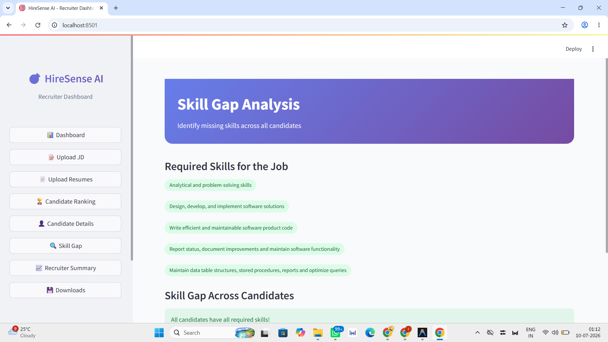
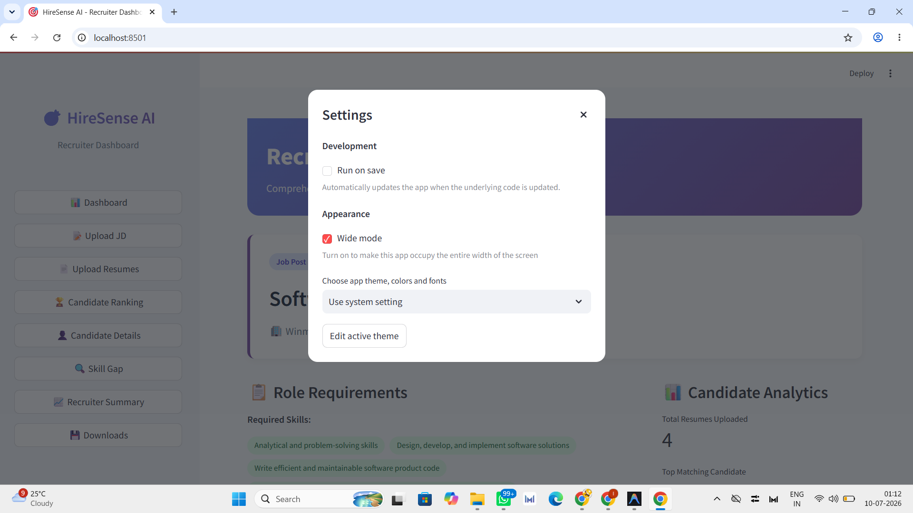

# 🤖 HireSense AI — ATS Resume Screening & Candidate Ranking Engine

[](https://python.org)
[](https://groq.com)
[](https://scikit-learn.org)
[](http://localhost:5000)

An intelligent **AI-Powered Resume Screening & Candidate Ranking Engine** that parses candidate resumes (PDF, DOCX, TXT), matches extracted technical skills and education qualifications against job description requirements, calculates weighted ATS scores using TF-IDF vectorization, generates AI recruiter insights, and serves interactive dashboards locally.

Built for the **Rooman Technologies — Junior AI Research Associate AI Agent Challenge**.

---

## 🚀 Step-by-Step Guide: How to Run the Project

### Step 1: Open Terminal in Project Directory
Navigate to the project root directory in your PowerShell or Command Prompt:
```bash
cd d:\HireSense_AI
```

### Step 2: Create & Activate Virtual Environment (Recommended)
```bash
# Create virtual environment
python -m venv .venv

# Activate on Windows (PowerShell / CMD):
.venv\Scripts\activate

# Activate on Linux / macOS:
source .venv/bin/activate
```

### Step 3: Install Required Dependencies
Install all core application dependencies from `requirements.txt`:
```bash
pip install -r requirements.txt
```

---

### Step 4: Configure Environment Variables (`.env`)
Open the [.env](file:///d:/HireSense_AI/.env) file located in the root directory:
```env
GROQ_API_KEY=your_groq_api_key_here
```
> 💡 **Note**: If `GROQ_API_KEY` is not provided, HireSense AI automatically utilizes a built-in structured evaluation engine fallback so the project runs seamlessly without an API key.

---

### Step 5: Run Candidate Resume Screening
To execute the ATS scoring engine, rank all resumes in `resumes/` against `job_description/jd.txt`, and automatically open the report in your web browser:

```bash
python app.py
```

#### What happens when you run `python app.py`:
1. Parses the target Job Description (`job_description/jd.txt`).
2. Reads and extracts text from all candidate resumes in `resumes/` (`PDF`, `DOCX`, `TXT`).
3. Cleans and normalizes text using regular expressions.
4. Computes dynamic skill match ratios, TF-IDF cosine similarity, and education alignment.
5. Calculates weighted final ATS scores.
6. Generates AI recruiter summaries (Strengths, Weaknesses, Recommendations).
7. Renders an interactive leaderboard in your terminal.
8. Exports reports to `output/ranked.csv`, `output/ranked.json`, and `output/report.html`.
9. **Automatically launches `output/report.html` in Google Chrome / default browser**.

---

### Step 6: Host & View on Localhost (`http://localhost:5000`)
To host the interactive Candidate Screening Dashboard on a local web server:

```bash
python server.py
```

#### Features of `server.py`:
- Hosts the web dashboard live at: **`http://localhost:5000`**
- Automatically opens **`http://localhost:5000`** in your browser.
- **Dynamic Port Selection**: If port 5000 is occupied, it automatically tries 5001, 5002, 5003, etc., preventing socket address conflicts (`WinError 10048`).

---

### Step 7: Run Automated Unit Tests
To verify all scoring, parsing, and loading modules:
```bash
python -m unittest discover -s tests
```

---

## 🏗 System Architecture

```
                    Job Description File (jd.txt)
                                  │
                                  ▼
                   ┌──────────────────────────────┐
                   │   Job Description Parser     │
                   └──────────────┬───────────────┘
                                  │
                       Extracted Skills & Degree
                                  │
                                  ▼
┌──────────────────┐    ┌──────────────────────────┐
│  Candidate Files ├───►│   Multi-Format Parser    │
│ (PDF, DOCX, TXT) │    │(PyMuPDF / docx / cleaner)│
└──────────────────┘    └─────────┬────────────────┘
                                  │
                                  ▼
                   ┌──────────────────────────────┐
                   │    ATS Scoring Engine        │
                   │  • 50% Skill Match           │
                   │  • 40% TF-IDF Similarity     │
                   │  • 10% Education Match       │
                   └──────────────┬───────────────┘
                                  │
                                  ▼
                   ┌──────────────────────────────┐
                   │   AI Recruiter Evaluation    │
                   │  (Groq LLM / Robust Fallback)│
                   └──────────────┬───────────────┘
                                  │
                                  ▼
      ┌───────────────────────────┼───────────────────────────┐
      ▼                           ▼                           ▼
┌───────────┐               ┌───────────┐               ┌──────────────────────────┐
│  ranked.csv               │ranked.json│               │report.html (Localhost)   │
└───────────┘               └───────────┘               └──────────────────────────┘
```

---

## 📊 ATS Scoring Methodology

The candidate **Final ATS Score** is calculated deterministically:

$$\text{Final Score} = (\text{Skill Match Score} \times 0.50) + (\text{TF-IDF Similarity} \times 0.40) + (\text{Education Match} \times 0.10)$$

| Component | Weight | Calculation |
| :--- | :---: | :--- |
| **Skill Match** | **50%** | $\frac{\text{Matched Required Skills}}{\text{Total JD Required Skills}} \times 100$ |
| **TF-IDF Similarity** | **40%** | Cosine similarity between TF-IDF term-frequency vectors |
| **Education Match** | **10%** | $100\%$ if candidate holds required degree level, else $0\%$ |

### Recommendation Badges

- **🟢 Highly Recommended**: Final Score $\ge 85\%$
- **🔵 Recommended**: Final Score $\ge 70\%$
- **🟡 Consider**: Final Score $\ge 50\%$
- **🔴 Not Recommended**: Final Score $< 50\%$

---

## 📂 Project Structure

```
HireSense_AI/
│
├── app.py                  # Main CLI application & report generator
├── server.py               # Localhost web server script (http://localhost:5000)
├── config.py               # Environment & API configuration loader
├── requirements.txt        # Python dependencies
├── .env                    # Groq API key configuration
├── README.md               # Detailed project documentation
│
├── job_description/
│   └── jd.txt              # Target job description text
│
├── resumes/
│   └── *.pdf, *.docx, *.txt# Candidate resumes directory
│
├── sample_data/
│   └── skills.txt          # Technical skills taxonomy database
│
├── templates/
│   └── report_template.html# Dashboard HTML layout template
│
├── assets/
│   └── style.css           # Modern CSS dashboard stylesheet
│
├── utils/
│   ├── jd_parser.py        # Job description extraction & skill matching
│   ├── resume_parser.py    # Resume text structuring
│   ├── pdf_parser.py       # PDF, DOCX, and TXT parser
│   ├── text_cleaner.py     # Text cleaning & regex normalizer
│   ├── skills_loader.py    # Skill database cache manager
│   ├── scorer.py           # Weighted ATS scoring engine
│   ├── llm.py              # Groq AI summary generator with fallback
│   ├── exporter.py         # CSV, JSON, and HTML report generator
│   └── logger.py           # System logging module
│
├── tests/
│   ├── test_jd_parser.py   # Unit tests for JD parser
│   ├── test_resume_parser.py # Unit tests for resume parser
│   ├── test_scorer.py      # Unit tests for scoring engine
│   └── test_skills_loader.py # Unit tests for skills loader
│
└── output/
    ├── ranked.csv          # Exported candidate CSV dataset
    ├── ranked.json         # Exported candidate JSON payload
    └── report.html         # Generated web dashboard report
```

---

## 🏆 Challenge Metadata

<<<<<<< HEAD
- **Track**: Junior AI Research Associate AI Agent Challenge
- **Organization**: Rooman Technologies
- **System**: HireSense AI Engine
- **License**: MIT
=======
### Requirements
- Python 3.10 or higher
- pip
- A Groq API key (free tier available)

### Step-by-Step Setup

1. **Clone the repository**
   ```bash
   git clone https://github.com/Ishaq7892/Rooman_HireSense-AI.git
   cd HireSense_AI
   ```

2. **Create a virtual environment**
   ```bash
   python -m venv venv
   ```

3. **Activate the virtual environment**
   - Windows:
     ```bash
     venv\Scripts\activate
     ```
   - Linux/MacOS:
     ```bash
     source venv/bin/activate
     ```

4. **Install dependencies**
   ```bash
   pip install -r requirements.txt
   ```

5. **Configure environment variables**
   - Copy `.env.example` to `.env`
   - Add your Groq API key to `.env`
   ```bash
   cp .env.example .env
   # Edit .env and set your GROQ_API_KEY
   ```

---

## 🔧 Environment Variables

Create a `.env` file in the root directory with these variables:

```env
# Groq API Configuration
GROQ_API_KEY=your_groq_api_key_here

# Backend Configuration
BACKEND_HOST=0.0.0.0
BACKEND_PORT=8000

# Optional: Embedding Model
EMBEDDING_MODEL=all-MiniLM-L6-v2
```

---

## 🚀 TO RUN THE APPLICATION

### 1. Start the Backend Server
```bash
# Using Uvicorn (recommended, with auto-reload)
python -m uvicorn backend.main:app --reload

# Or without auto-reload
python -m uvicorn backend.main:app
```
The FastAPI backend will start at: http://localhost:8000

API Documentation (Swagger UI): http://localhost:8000/docs

### 2. Start the Frontend Dashboard
In a new terminal:
```bash
streamlit run frontend/app.py
```
The Streamlit dashboard will open at: http://localhost:8502 (the exact port will be shown in the terminal)

---

## 📋 API Documentation

### Main Endpoints (`/api/v1/hiresense`)
| Method | Endpoint | Description |
|--------|----------|-------------|
| `POST` | `/upload-jd` | Upload and parse a job description |
| `POST` | `/upload-resume` | Upload and parse a single resume |
| `POST` | `/upload-resumes` | Upload and parse multiple resumes |
| `POST` | `/rank/{jd_id}` | Rank candidates for a job description |
| `GET` | `/summary/{jd_id}` | Get job description summary |
| `GET` | `/candidate/{resume_id}` | Get candidate details |
| `POST` | `/download-csv/{jd_id}` | Download rankings as CSV |
| `POST` | `/download-json/{jd_id}` | Download rankings as JSON |

### Individual Endpoints
| Group | Endpoint | Description |
|-------|----------|-------------|
| Resumes | `/api/v1/resume/*` | Resume upload/parsing/extraction |
| Job Descriptions | `/api/v1/job/*` | JD upload/parsing/extraction |
| Embeddings | `/api/v1/embeddings/*` | Embedding generation and storage |
| Similarity | `/api/v1/similarity/*` | Cosine similarity calculations |
| ATS Scoring | `/api/v1/ats/*` | ATS score calculation |
| Ranking | `/api/v1/ranking/*` | Candidate ranking |
| Interview Questions | `/api/v1/interview-questions/*` | Question generation |

Full API docs available at http://localhost:8000/docs when the backend is running.

---

## 📊 Scoring Formula

### Overall ATS Score
The total ATS score is calculated using the weighted average of these components:

| Component | Weight | Description |
|-----------|--------|-------------|
| Skill Match | 40% | Match against required and preferred skills |
| Experience | 25% | Relevant work experience |
| Education | 15% | Education background match |
| Project Match | 10% | Relevant projects |
| Certifications | 10% | Relevant certifications |

```
Total ATS Score =
    (Skill_Match * 0.40) +
    (Experience * 0.25) +
    (Education * 0.15) +
    (Project_Match * 0.10) +
    (Certifications * 0.10)
```

### Combined Ranking Score
The final combined score (used for ranking) is a weighted average of:
- ATS Score (default weight: 0.6)
- Semantic Similarity Score (default weight: 0.4)

Weights are configurable in the ranking endpoint!

```
Combined_Score =
    (ATS_Score * ats_weight) +
    (Similarity_Score * similarity_weight)
```

---

## 📈 Screenshots

### Dashboard


### Candidate Ranking


### Candidate Details


### Upload job discription


### Upload Resume


### Recruitment Analiysis


### Skill Gap


### Setting 


---

## 🚀 Future Improvements

- [ ] Persistent database (PostgreSQL/MongoDB) instead of in-memory
- [ ] User authentication & multi-user support
- [ ] Cloud deployment (AWS/GCP/Azure)
- [ ] Batch processing for large number of resumes
- [ ] Customizable scoring weights via UI
- [ ] Email notifications
- [ ] Integration with ATS platforms (Greenhouse, Lever, etc.)
- [ ] Interview scheduling integration
- [ ] Historical hiring data analytics
- [ ] Custom prompt templates
- [ ] Multi-language support

---

## 📜 License

This project is open source and available for educational and personal use.

---

## 🤝 Contributing

Feel free to fork this repository and make improvements! Pull requests are welcome.

---

## 🙏 Acknowledgments

- **Groq**: For providing the LLM API
- **Sentence Transformers**: For embeddings
- **FAISS**: For vector storage
- **LangChain**: For AI orchestration
- **Streamlit**: For the dashboard framework
- **FastAPI**: For the backend framework

---

<p align="center">
  Made with ❤️ for Junior AI Research Associate Challenge
</p>
>>>>>>> a0d8a1987c461eb734d189c4f96cd8b9ae39c3d3
